<div align="center">

# LGCMS Frontend

### Learning & GenAI-based Content Management System

**강의 탐색부터 HLS 학습 플레이어, 실시간 알림, AI 튜터와 강사 대시보드까지 연결한 React 기반 LCMS 프론트엔드**

<p>
  
  
  
  
  
</p>

<p>
  <a href="https://github.com/LGCNS-FINAL-LGCMS">
    
  </a>
  <a href="https://github.com/LGCNS-FINAL-LGCMS/front">
    
  </a>
</p>

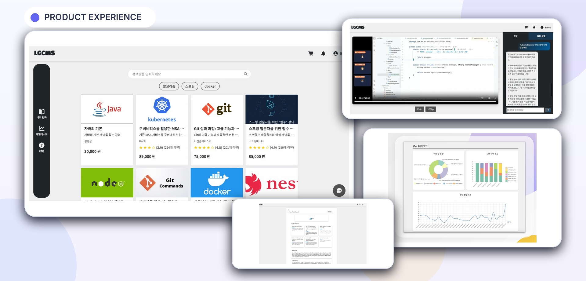

</div>

---

## Project Overview

LGCMS는 기존 온라인 강의 플랫폼에 생성형 AI 기반 학습 지원 기능을 결합한 차세대 LCMS 플랫폼입니다.

프론트엔드는 **학생·강사·관리자 역할별 사용자 흐름**을 하나의 React 애플리케이션에서 제공하며, 강의 탐색과 결제 같은 일반 LMS 기능부터 AI 레벨 테스트, 강의 자료 기반 튜터 챗봇, 강사 데이터 분석 화면까지 통합합니다.

| Item | Description |
|---|---|
| 개발 기간 | 2025.07.04 – 2025.09.11 |
| 팀 구성 | 8명 |
| 담당 영역 | React·TypeScript 프론트엔드 |
| 주요 사용자 | Student · Lecturer · Admin |
| 서비스 구조 | 13개 도메인 서비스와 연동하는 MSA 프론트엔드 |

### 사용자별 제공 가치

| Student | Lecturer | Platform |
|---|---|---|
| 강의 검색·구매·수강 | 강의·강좌 등록 및 수정 | 역할 기반 접근 제어 |
| 진도·Q&A·수강평 관리 | 수강생 Q&A 관리 | 공통 API·인증 처리 |
| AI 레벨 테스트와 리포트 | 수익·수강·완강 대시보드 | SSE 실시간 알림 |
| 강의 자료 기반 AI 튜터 | 리뷰·질문 기반 AI 리포트 | HLS 기반 콘텐츠 재생 |

---

## Product Experience

### 1. 강의 탐색과 검색

<p align="center">
  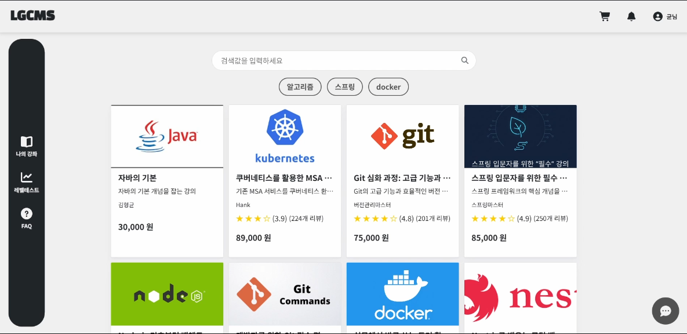
</p>

- 키워드와 카테고리를 조합한 강의 검색
- 카드 기반 강의 목록과 반응형 그리드
- 페이지네이션 API를 연결한 무한 스크롤
- 데이터 로딩 중 스켈레톤 UI 제공
- 서비스 이용 질문을 처리하는 플로팅 가이드 챗봇

### 2. HLS 학습 플레이어

<p align="center">
  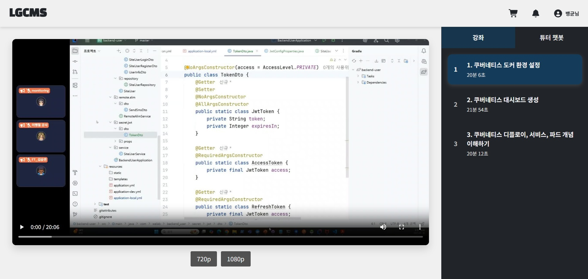
</p>

- `hls.js` 기반 HLS 스트리밍 재생
- 브라우저가 HLS를 직접 지원하는 경우 네이티브 재생으로 폴백
- 매니페스트의 화질 레벨을 읽어 수동 화질 선택 UI 제공
- 강좌 목록과 현재 강좌 상태를 사이드 패널로 제공
- 서버에 저장된 진도율을 기준으로 이전 시청 위치 복원
- 재생·일시정지·탐색·페이지 이탈 상태에 맞춰 진도 저장

### 3. 강의 자료 기반 AI Tutor

<p align="center">
  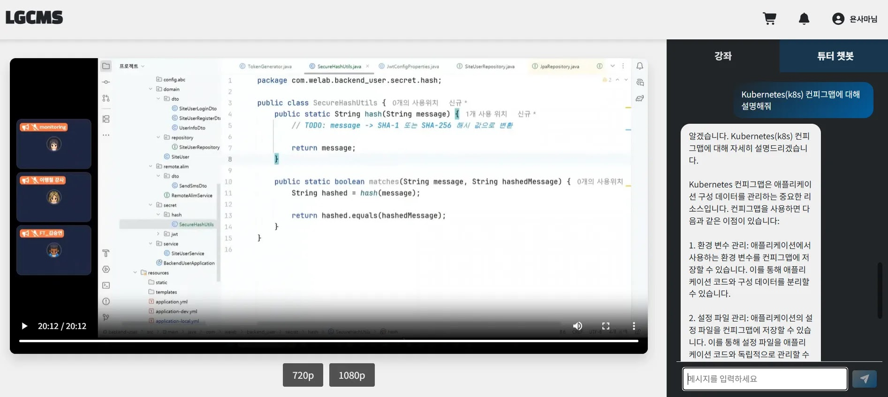
</p>

- 학습 플레이어 내부에서 강좌 목록과 AI Tutor 탭 전환
- 현재 강의 ID를 포함해 질문을 전송하여 강의별 문서 범위 분리
- 사용자 질문과 AI 답변을 대화형 메시지로 누적 표시
- 영상 시청 흐름을 벗어나지 않고 즉시 학습 질문 처리

### 4. 강의·강좌 등록

<p align="center">
  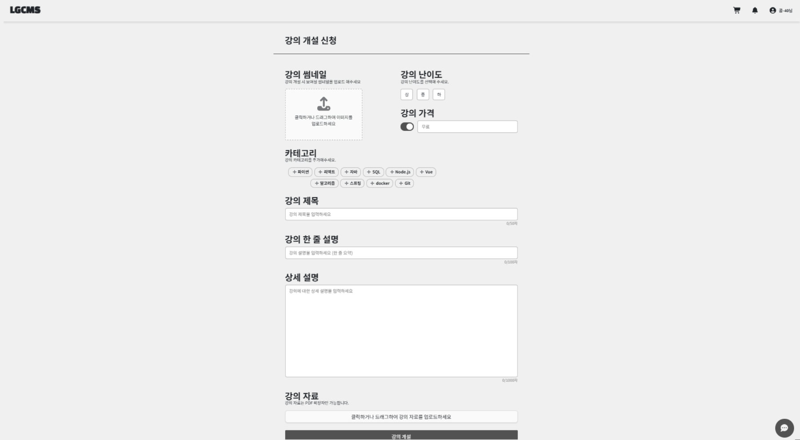
</p>

- 강의 제목·설명·가격·카테고리·태그 입력
- Drag & Drop 방식의 썸네일 및 영상 등록
- `react-easy-crop`과 Canvas를 이용한 16:9 썸네일 크롭
- 파일 형식·용량·필수 입력값 검증
- 대용량 영상 업로드 중 로딩 오버레이와 상태 안내

### 5. AI Level Test

<table>
  <tr>
    <td width="50%" align="center">
      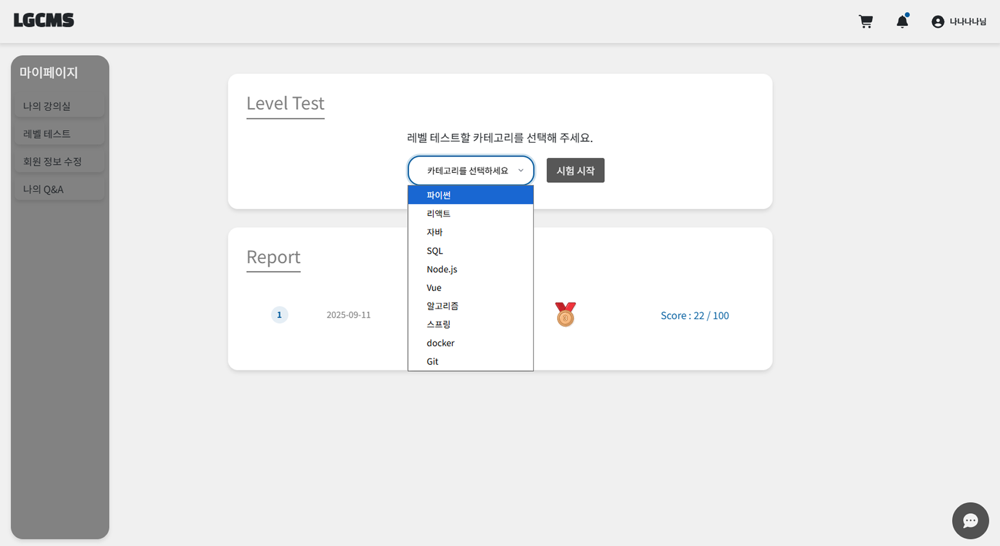
      <br/><b>기술 카테고리 선택</b>
    </td>
    <td width="50%" align="center">
      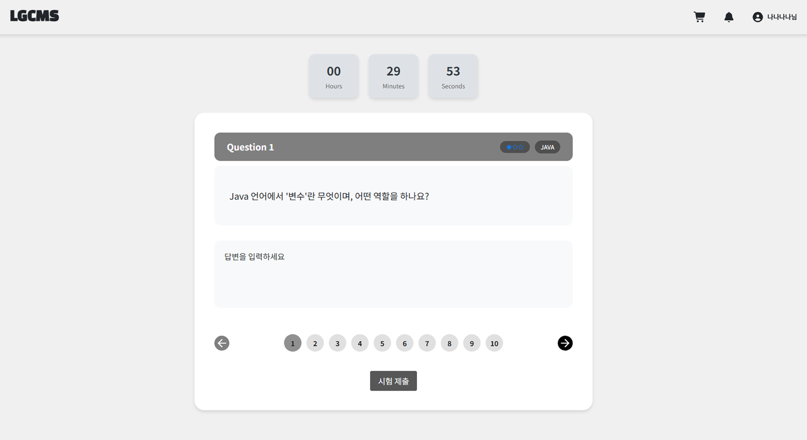
      <br/><b>난이도별 서술형 테스트</b>
    </td>
  </tr>
</table>

<p align="center">
  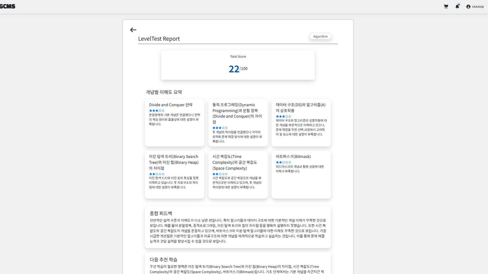
</p>

- 기술 카테고리 선택 후 상·중·하 난이도의 서술형 문제 진행
- 문항 이동, 제한 시간과 제출 상태를 한 화면에서 관리
- 채점 완료 후 개념별 이해도, 강점·약점과 다음 학습 방향 제공

### 6. 강사 대시보드와 AI 리포트

<table>
  <tr>
    <td width="50%" align="center">
      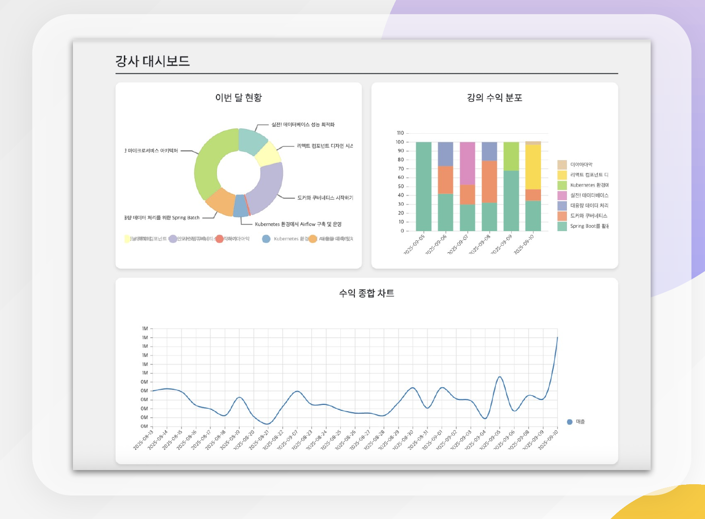
      <br/><b>강의 지표 대시보드</b>
    </td>
    <td width="50%" align="center">
      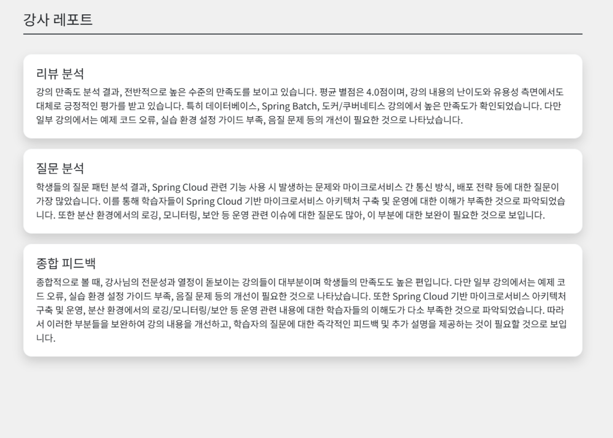
      <br/><b>AI 강의 개선 리포트</b>
    </td>
  </tr>
</table>

- Nivo의 Pie·Bar·Line 차트로 수익, 수강률과 완강률 시각화
- 데이터 로딩·빈 데이터·오류 상태를 분리해 화면 피드백 제공
- 학생 수강평과 질문 분석 결과를 강의 장점·단점·개선 방향으로 표시

---

## Main Features

### Student

- Google OAuth 로그인과 추가 회원 정보 등록
- 강의 검색, 카테고리 필터와 상세 정보 조회
- 장바구니, 선택 결제와 결제 결과 처리
- HLS 강좌 시청과 진도율 저장
- 수강평 작성·수정과 학생 Q&A 관리
- AI 레벨 테스트, 학습 리포트와 강의 자료 기반 Tutor
- SSE 기반 실시간 알림

### Lecturer

- 강사 전용 페이지와 역할 기반 사이드바
- 강의 개설·수정·출시
- 강좌 영상 등록·수정·삭제와 순서 관리
- 수강생 질문 조회와 답변
- 수익·수강·완강 지표 대시보드
- 리뷰·질문 분석 기반 AI 강사 리포트

### Admin

- 역할 기반 관리자 화면 접근
- 강사 승인 등 사용자 관리 기능
- 공통 FAQ와 플랫폼 운영 데이터 관리

---

## Frontend Architecture

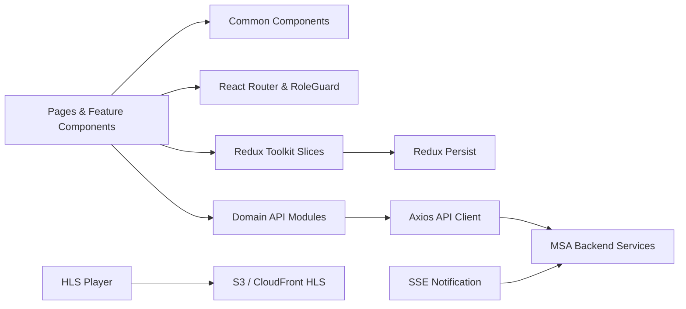

### State Management

도메인별 Slice를 분리하고 하나의 Root Store에서 결합했습니다.

```text
keyword · lectureData · lecturerLectureData · studentLectureData
category · auth · token · guide · payment
currentLecture · currentQna · faqData · studentReport
```

- Redux Toolkit `createSlice`와 `createAsyncThunk`로 비동기 요청 상태 관리
- `idle / loading / succeeded / failed` 상태를 명시해 UI 분기 단순화
- `redux-persist`로 로그인 토큰과 주요 전역 상태를 `localStorage`에 유지
- API 계층에 Store를 주입해 인터셉터에서 토큰과 인증 상태를 일관되게 처리

### Routing and Authorization

- `React Router` 기반의 학생·강사·관리자 화면 라우팅
- `GUEST → STUDENT → LECTURER → ADMIN` 역할 계층 정의
- `RoleGuard`에서 최소 접근 역할을 검사하고 허용되지 않은 접근을 메인 화면으로 전환
- 공통 Header·Chat·Student/Lecturer Sidebar를 애플리케이션 레벨에서 관리

### Component and Styling Strategy

- `pages`는 화면 조합과 데이터 흐름을 담당
- `components`는 공통 UI와 도메인별 기능 단위로 분리
- Button, LectureCard, QnaCard, Chat UI 등 공통 컴포넌트 재사용
- `ThemeProvider`에서 색상·타이포그래피·간격·Shadow·Z-index 토큰 관리
- Styled Components의 props와 미디어 쿼리를 이용해 상태별·반응형 스타일 구성

---

## Performance and Reliability

> 아래 항목은 저장소 코드에서 확인되는 구현 기준입니다. Lighthouse, Web Vitals와 번들 분석에 대한 정량 측정값은 포함하지 않았습니다.

| Area | Implementation | Effect |
|---|---|---|
| 토큰 갱신 동시성 | `isRefreshing`과 대기 요청 Queue를 사용해 갱신 중 발생한 요청을 대기시킨 뒤 새 토큰으로 재시도 | 다수 요청이 동시에 실패해도 Refresh API 중복 호출 억제 |
| 강의 목록 | 서버 페이지네이션, `hasMore`, 로딩 상태 검사와 무한 스크롤 결합 | 최초 렌더링 데이터량을 제한하고 중복 추가 요청 방지 |
| 로딩 UX | 강의 카드 Skeleton과 기능별 Loading·Empty·Error 상태 분리 | 느린 네트워크에서도 레이아웃 변화와 빈 화면 최소화 |
| 실시간 알림 | 인증 사용자에게만 SSE 연결하고 Effect Cleanup에서 연결 종료 | 비회원의 불필요한 연결과 컴포넌트 해제 후 잔여 연결 방지 |
| HLS 리소스 | 강좌 변경·컴포넌트 해제 시 HLS 인스턴스 `destroy` | Media Source와 네트워크 리소스 정리 |
| 진도 저장 | 영상 재생 중에만 5초 간격 저장, Pause·Ended 시 타이머 중지, Seek·Visibility 변경 시 추가 저장 | 불필요한 상시 타이머를 피하면서 학습 진도 유실 감소 |
| 계산 최적화 | 장바구니 선택 항목 합계를 `useMemo`로 계산 | 관련 상태가 바뀌지 않을 때 합계 재계산 방지 |
| 이벤트 안정성 | Dropzone과 검색 요청 Handler에 `useCallback` 적용 | 자식 라이브러리에 전달되는 Handler 참조 안정화 |
| 입력 데이터 | 파일 크기·형식·글자 수·공백 입력을 클라이언트에서 사전 검증 | 실패 요청과 잘못된 데이터 전송 감소 |

### Axios Authentication Flow

```text
API 요청
→ Redux Store의 Access Token을 Authorization Header에 추가
→ 인증 오류 발생
→ 이미 Refresh 중이면 요청 Queue에 등록
→ 최초 요청만 Refresh API 실행
→ 새로운 Access/Refresh Token 저장
→ 대기 중인 요청에 새 Access Token 전달
→ 원래 요청 재시도
```

FormData 요청에서는 브라우저가 Multipart Boundary를 직접 설정하도록 기본 JSON `Content-Type`을 제거합니다.

---

## My Contributions

이 저장소의 GitHub PR 이력을 기준으로 다음 프론트엔드 영역을 구현하고 통합했습니다.

### Foundation

- 공통 Header와 역할별 Navigation·Sidebar
- Button, Q&A Card, Interest Selector 등 공통 컴포넌트
- 공통 Axios Client, 인증 Header와 로그아웃 처리
- Redux Store 연동과 Header 인증 상태 반영
- 역할별 Route Guard와 화면 접근 정책

### Lecture Discovery and Learning

- 메인 강의 목록, 키워드·카테고리 검색과 무한 스크롤
- 강의 상세 정보, 커리큘럼, 장바구니, 수강평과 Q&A
- 강좌 시청 화면과 HLS 스트리밍 플레이어
- 영상 화질 선택과 학습 진도 저장·복원
- 강의 시청 화면 내 AI Tutor UI와 API 연결

### Lecturer Workflow

- 강사 보유 강의 목록
- 강의 개설·수정·출시 화면
- 강좌 영상 등록·수정·삭제 관리
- 썸네일 크롭, 영상 업로드와 입력 검증
- 강사 Q&A 조회와 답변 흐름

### Integration and Stabilization

- Header 알림 SSE 연결과 알림 Dropdown
- API Endpoint·응답 구조 변경 대응
- 권한별 UI와 비회원·구매자 조건 처리
- 통합 단계의 화면 오류, 라우팅, 입력 제한과 UX 수정

<details>
<summary><b>대표 Pull Requests</b></summary>

| PR | Scope |
|---|---|
| `#4` | 메인 페이지, 강의 목록과 무한 스크롤 |
| `#10` | 공통 API Client와 로그아웃 API |
| `#25` | 관심사·Q&A·SideTab 공통 컴포넌트 |
| `#39` | 강의 개설 페이지와 API 연결 |
| `#44` | 강좌 추가·삭제·수정과 영상 업로드 |
| `#49` | 강의 상세·수강평·Q&A·장바구니 |
| `#51` | HLS 강좌 시청 화면 |
| `#64` | Header SSE 실시간 알림 |
| `#66` | 강의 자료 기반 Tutor 챗봇 |
| `#83` | API·SSE·무한 스크롤 통합 오류 수정 |
| `#102` | 라우팅·권한·알림·Q&A 등 전반적 안정화 |

</details>

---

## Tech Stack

| Category | Technology | Usage |
|---|---|---|
| Core | React 19, TypeScript 5.8, Vite 7 | 컴포넌트 UI, 타입 안정성, 개발·빌드 환경 |
| State | Redux Toolkit, React Redux, Redux Persist | 도메인 상태, 비동기 요청, 상태 영속화 |
| Routing | React Router DOM | 페이지 라우팅과 역할 기반 접근 제어 |
| Styling | Styled Components, ThemeProvider, Bootstrap | 공통 디자인 토큰과 반응형 UI |
| HTTP | Axios, qs | 공통 API Client, 인터셉터, Query 직렬화 |
| Authentication | Google OAuth, JWT Decode | Google 로그인과 토큰 기반 인증 |
| Realtime | EventSource Polyfill, SSE | 실시간 알림 수신 |
| Streaming | Hls.js, HTML5 Video | HLS 재생, 품질 선택과 진도 관리 |
| Visualization | Nivo Pie, Bar, Line | 강사 통계 대시보드 |
| Upload | React Dropzone, React Easy Crop, Canvas | 썸네일 크롭과 영상·자료 업로드 |
| UI | Font Awesome, React Spinners | 아이콘과 비동기 상태 피드백 |
| Quality | ESLint, TypeScript Build | 정적 검사와 빌드 전 타입 검증 |

---

## Project Structure

```text
src/
├─ api/                     # 도메인별 API 함수와 공통 Axios Client
├─ assets/
│  └─ styles/               # GlobalStyle, Theme와 폰트
├─ components/
│  ├─ Common/               # Button, Card, Chat, RoleGuard 등
│  ├─ Header/               # Header, 알림 Dropdown과 SSE Hook
│  ├─ InfiniteScrollController/
│  ├─ CreateLecture/        # 강의 입력, 이미지·자료 업로드
│  ├─ LessonManagement/     # 강좌 목록과 영상 업로드
│  ├─ LectureInfo/          # 커리큘럼, 수강평과 Q&A
│  └─ Payment/              # 장바구니와 결제 UI
├─ constants/               # API Endpoint와 Page Path
├─ hooks/                   # 공통 Custom Hook
├─ layouts/                 # 공통 페이지 Layout
├─ pages/                   # Route 단위 화면
├─ redux/                   # 도메인 Slice와 Root Store
├─ types/                   # API·도메인·Styled Component 타입
└─ utils/                   # 오류 처리와 데이터 변환 유틸리티
```

---

## Getting Started

### Prerequisites

- Node.js
- npm
- 연동 가능한 LGCMS Backend API
- Google OAuth Client ID

### Installation

```bash
npm install
```

### Environment Variables

루트에 `.env.local` 파일을 생성합니다.

```env
VITE_API_URL=https://your-api.example.com
VITE_GOOGLE_CLIENT_ID=your-google-oauth-client-id
```

실제 운영 키와 내부 API 주소는 저장소에 커밋하지 마십시오.

### Development

```bash
npm run dev
```

### Lint

```bash
npm run lint
```

### Production Build

```bash
npm run build:prod
```

`build`와 `build:prod`는 TypeScript Project Build를 먼저 실행한 뒤 Vite Bundle을 생성합니다.

---

## Related Repositories

| Repository | Responsibility |
|---|---|
| [LGCMS Organization](https://github.com/LGCNS-FINAL-LGCMS) | 전체 프로젝트 저장소 |
| [front](https://github.com/LGCNS-FINAL-LGCMS/front) | React·TypeScript 프론트엔드 |
| [infra-terraform](https://github.com/LGCNS-FINAL-LGCMS/infra-terraform) | AWS 인프라 프로비저닝 |

---

<div align="center">

**LG CNS AM Inspire Camp 2기 Final Project**  
**Team 교육저기다. · 2025**

</div>
